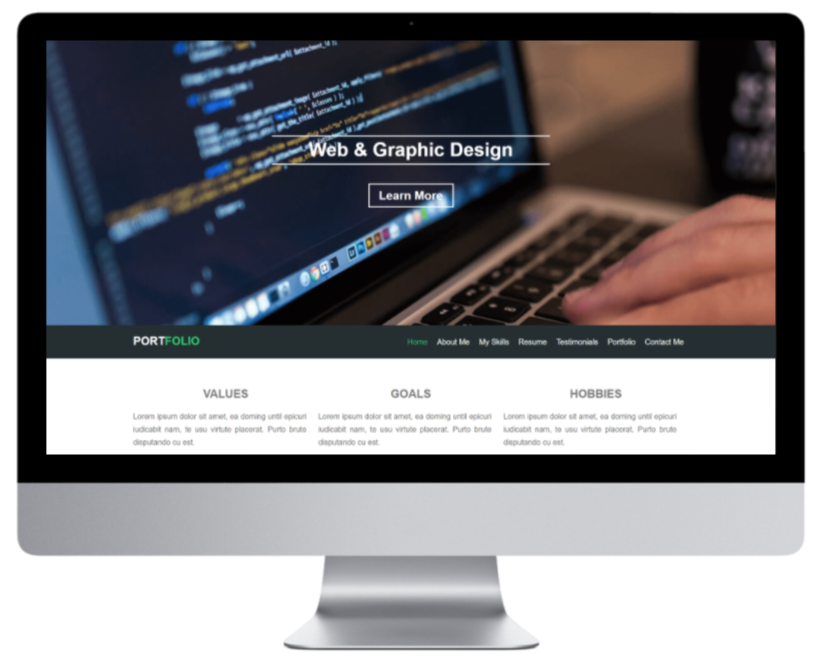

# Portfolio  

  

One HTML landing page template for a personal portfolio.
(Not Responsive)

  

## Demo

  

## Getting Started

You can try the Template from [here](https://mohamed-elhawary.github.io/portfolio/)

## Prerequisites

Just Modern Browser like "Chrome" and a Code Editor for Deployment and Develop.

## Built With

* HTML
* CSS  

## Libraries  

* Font Awesome  
* Normalize.css  

## Author

* Mohamed Elhawary  

## Contact Me  

* Email: mohamed.k.elhawary@gmail.com

## Deploy with Me

Feel Free to Deploy it with me, send Issues or a Pull Request and i'll deal with you, just test it First.

## License

Licensed under the [MIT License](LICENSE)

